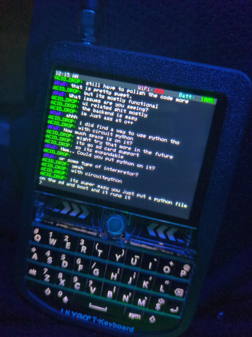
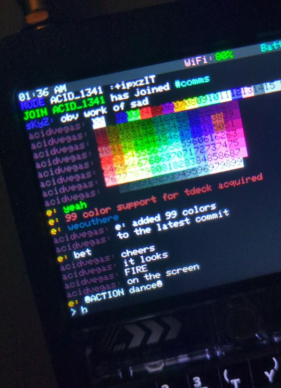
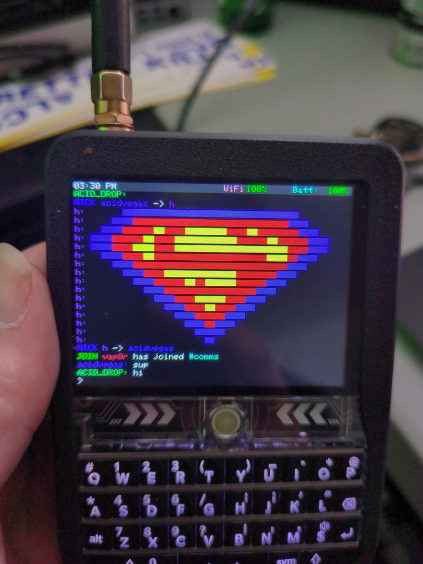
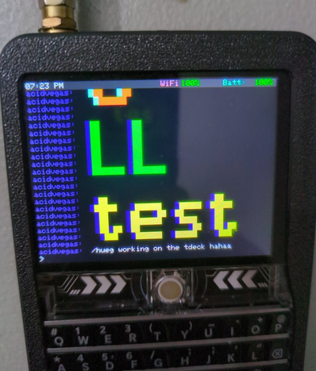

  

# Work in progress
This is a custom firmware being developed for the [LilyGo T-Deck](https://www.lilygo.cc/products/t-deck), currently it is experimental & buggy while we are in beta status.

If you are familiar with or use [Internet Relay Chat](https://en.wikipedia.org/wiki/IRC), we have a team of developers working on this project in **#comms** on **[irc.supernets.org](irc://irc.supernets.org)**, join us if you have ideas, bugs, or want to get your hands dirty & develope this project with us.

Consider sponsoring our project, all the money goes towards motivation to develope on this, we also like buying T-Decks for people who want to learn about this stuff!

# Flashing the Firmware
###### Using VS Code
1. Add your user to the `dialout` group: `sudo gpasswd -a YOURUSERNAME dialout` *(You will need to re-login after adding your user to the `dialout` group for it to take affect)*
2. Install [Visual Studio Code](https://code.visualstudio.com/)
3. Install the [PlatformIO plugin](https://platformio.org/install/ide?install=vscode)
4. Hold down the trackball on the device, turn it on, and plug it in to the computer.
5. Press **F1** and select `PlatformIO: Build`
6. Press **F1** and select `PlatformIO: Upload`
7. Press the RST *(reset)* button on the device.

###### Using ESP Tool
1. Take the `firmware.bin` file from the release page and download it.
2. Install [esptool](https://pypi.org/project/esptool/): `pip install esptool`
3. Hold down the trackball on the device, turn it on, and plug it in to the computer.
4. Confirm the serial device in your `/dev` directory *(Your device will likely be `/dev/ttyAMC0` or `/dev/ttyUSB0`)*
5. Flash the device: `esptool.py --chip esp32-s3 --port /dev/ttyUSB0 --baud 115200 write_flash -z 0x1000 firmware.bin`
6. Press the RST *(reset)* button on the device.

# Command & Control
###### Menu controls
On boot, if you press the `w` key, it will wipe all of the stored preferences.

The device will scan for WiFi networks on boot. Once the list is displayed, you can scroll up and down the list with the `u` key for UP and the `d` key for down.

###### IRC commands
| Command         | Description                 |
| --------------- | --------------------------- |
| `/info`         | Show hardware information   |
| `/me <message>` | Send an ACTION message      |
| `/nick <new>`   | Change your NICK on IRC     |
| `/raw <data>`   | Send RAW data to the server |

# Debugging over Serial
1. Install screen: `apt-get install screen` *(or whatever package manager you use)*
2. Plug in your device via USB.
2. Turn the device on, and run: `screen /dev/ttyAMC0 9600` *(again, this can also be /dev/ttyUSB0)*

# Roapmap
###### Device functionality
- [X] Screen timeout on inactivity *(default 30 seconds)*
  - [ ] Keyboard backlight timeout with screen timeout
- [ ] Trackball support
- [X] Speaker support
  - [X] Bootup sounds
  - [X] IRC mention sounds
- [ ] GPS support
- [ ] Lora support
- [ ] BLE support
- [ ] SD card support

###### Features
- [X] Wifi scanning & selection menu
  - [x] Saved wifi profiles
- [ ] Wifi Hotspot
- [ ] Notifcations Window *(All notifications will go here, from IRC, Gotify, Meshtastic, or anything)*
- [X] Status bar *(Time, Date, Notification, Wifi, and Battery)*
  - [ ] XBM icons for status bar items
- [ ] Allow specifying the IRC server, port, TLS, nick, etc...
- [ ] Screensaver
- [X] Serial debug logs

###### Applications
- [X] IRC Client
  - [X] `/raw` command for IRC client to send raw data to the server
  - [ ] Add scrolling backlog for IRC to see the last 200 messages
  - [ ] Multi-buffer support *(`/join` & `/part` support with switching between buffers with `/0`, `/1`, `/2`, etc)* *(`/close` also for PM buffers or kicked from channels)*
  - [ ] Status window for network to show RAW lines from the IRC server *(buffer 0)*
  - [ ] Hilight monitor buffer
  - [X] Hilight support *(so we can see when people mention our NICK)*
  - [X] 99 color support
  - [ ] `/pm` support *(it should open a buffer for pms)*
  - [ ] NickServ support
- [ ] ChatGPT
- [ ] SSH Client
- [ ] Wardriving
- [ ] Evil Portal AP
- [ ] Local Network Probe *(Scans for devices on the wifi network you are connected to, add port scanning)*
- [ ] Gotify *(in progress)*
- [ ] Meshtastic *(in progress)*
- [ ] Spotify/Music player *(can we play audio throuigh Bluetoth headphones or the on-board speaker?)*
- [ ] Syslog *(All serial logs will be displayed here for on-device debugging)*

# Previews
###### 99 Color support

###### Full ASCII support for PUMPERS

###### Support for /HUEG

___

###### Mirrors for this repository: [acid.vegas](https://git.acid.vegas/acid-drop) • [SuperNETs](https://git.supernets.org/acidvegas/acid-drop) • [GitHub](https://github.com/acidvegas/acid-drop) • [GitLab](https://gitlab.com/acidvegas/acid-drop) • [Codeberg](https://codeberg.org/acidvegas/acid-drop)
