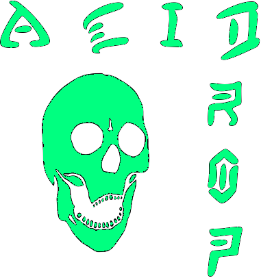
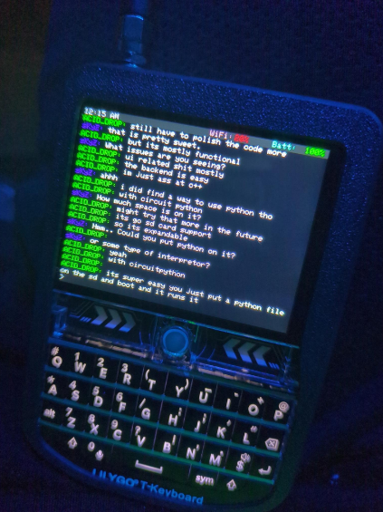

<p align="center">
  
</p>

# ACID DROP

Custom firmware for the [LilyGo T-Deck Plus](https://www.lilygo.cc/products/t-deck) (and the
original T-Deck): an IRC client with a phone-style LVGL interface, built for people who still
care what `^C04,01` looks like on a 320x240 screen.

Development happens in **#superbowl** on **[irc.supernets.org](irc://irc.supernets.org)**. Come
break it with us.



## What it does

**Interface**
- LVGL 9 UI on LovyanGFX, with touch, trackball and keyboard all wired into the same focus system
- Status bar with clock, battery, WiFi, Bluetooth, GPS and sound indicators
- Home screen of app tiles showing live state: IRC connection and unread count, WiFi SSID, GPS fix
- Apps: IRC, WiFi, Settings, GPS, Syslog, About

**IRC**
- Multiple windows: a server/status window, channels and private messages, switchable by tab, arrow keys or `/0`..`/9`
- Full mIRC formatting: 99-colour palette, hex colours (`^D`), bold, italic, underline, strikethrough and reverse video
- ANSI escape sequences (SGR), including 256-colour and truecolour, so pasted terminal output and `.ans` art render
- A real character-cell renderer with per-cell background colours, because most ASCII/ANSI art is drawn with coloured spaces
- Monospace CP437 font covering box drawing, block elements and shading; block characters are drawn as rectangles so tiled art has no seams
- Lines that are not valid UTF-8 are decoded as code page 437, which is how BBS-era art usually arrives
- TLS with SASL PLAIN, NickServ fallback, automatic plaintext fallback to 6667
- The socket connect runs on its own task, so a TLS handshake does not freeze the UI
- Reconnects automatically with exponential backoff, rejoins after a kick, and keeps retrying channels that are `+i`, `+k`, `+b` or full
- Configurable delay between the welcome numeric (001) and the first JOIN, defaulting to six seconds
- Channels the server joins you into unasked are parted automatically
- Per-channel saved config: key, auto-join and retry, edited on the device

**Everything else**
- Around ninety settings across twelve sections, all editable on the device, all applied live
- Scrollback lives in internal RAM (not PSRAM) and is trimmed automatically if free heap runs low
- GNSS on the T-Deck Plus, LoRa (SX1262), BLE, SD card
- On-device syslog so you can debug without a USB cable

## Flashing

### PlatformIO

```sh
pio run -e t-deck-plus -t upload    # T-Deck Plus (with GNSS)
pio run -e t-deck      -t upload    # original T-Deck
pio device monitor
```

Hold the trackball down, turn the device on, then plug it into the computer to get it into
download mode. On Linux, add yourself to the `dialout` group first.

### esptool

```sh
pip install esptool
esptool.py --chip esp32-s3 --port /dev/ttyUSB0 --baud 921600 write_flash -z 0x0 firmware.bin
```

## Using it

### Keys

| Key                  | What it does                                  |
| -------------------- | --------------------------------------------- |
| Trackball up/down    | Move focus; scrolls the message window in IRC  |
| Trackball left/right | Adjust the focused control; changes window in IRC |
| Trackball click      | Select whatever has focus                     |
| **Trackball hold**   | **Back to the home screen, from anywhere**    |
| Back arrow, top left | Leave the current app                         |
| Hold `w` at boot     | Erase every setting and reboot                |

The T-Deck keyboard has no escape key, which is why holding the trackball is the way out.

### IRC commands

| Command                | Description                             |
| ---------------------- | --------------------------------------- |
| `/join #chan [key]`    | Join a channel                          |
| `/part [#chan]`        | Leave a channel                         |
| `/close`               | Close the current window                |
| `/msg <target> <text>` | Send a message without opening a window |
| `/query <nick>`        | Open a private message window           |
| `/me <action>`         | Send a CTCP ACTION                      |
| `/nick <name>`         | Change nick                             |
| `/topic [text]`        | Show or set the channel topic           |
| `/names`               | Re-request the user list                |
| `/connect`             | Connect to the configured server        |
| `/disconnect`          | Disconnect and stay offline             |
| `/quit [message]`      | Quit with a message                     |
| `/mode [#chan] <modes>`| Set or query modes                      |
| `/op` `/deop` `/voice` `/devoice` | Channel privileges           |
| `/kick` `/ban` `/unban` `/kickban` | Moderation                  |
| `/invite <nick>`       | Invite someone                          |
| `/list`                | List channels (results in the status window) |
| `/whois` `/whowas` `/who` `/ison` | Look people up               |
| `/away [reason]` `/back` | Set or clear away                     |
| `/raw <line>`          | Send a raw protocol line                |
| `/clear`               | Clear the current window                |
| `/settings` `/channels`| Open the IRC settings or channel list   |
| `/0` .. `/9`           | Jump to a window by number              |
| `/help`                | List these                              |

Anything not listed is upper-cased and sent to the server as typed, so `/lusers`, `/motd`,
`/stats` and anything else the server supports work without the firmware knowing about them.
`//text` sends a line that really does start with a slash.

### Settings

Everything lives in one registry in `src/core/Settings.cpp`. Adding an option means adding one
row there: storage, the settings screen and JSON import/export are all generated from it.

The registry is split into two groups. The **Settings** app shows Device, Display, Sound, Power,
WiFi, GPS, LoRa, Bluetooth and Advanced. The **IRC app's own gear button** shows Server,
Identity, Authentication, Connection and Appearance, so the client is configured where it is
used.

The values that control reconnect behaviour are under **Connection**:

| Setting              | Default | Meaning                                          |
| -------------------- | ------- | ------------------------------------------------ |
| Join delay           | 6000 ms | Wait after 001 before the first JOIN             |
| Auto-reconnect       | on      | Reconnect whenever the link drops                |
| Reconnect delay      | 5 s     | First retry delay, doubling up to the max        |
| Max backoff          | 120 s   | Ceiling for the reconnect delay                  |
| Rejoin on kick       | on      | Come back after being kicked                     |
| Kick rejoin delay    | 3 s     | How long to wait before rejoining                |
| Retry failed joins   | on      | Keep trying `+i`, `+k`, `+b` and full channels   |
| Join retry delay     | 5 s     | How often to retry those                         |
| Ping timeout         | 260 s   | Drop a link that has gone quiet                  |

## Building

### Requirements

- PlatformIO Core
- Node and `lv_font_conv`, only if you want to regenerate the fonts

### Fonts

`src/ui/fonts/` holds two generated LVGL fonts. To rebuild them:

```sh
npm install -g lv_font_conv
./tools/build_fonts.sh
```

The sizes are 10px and 15px because those are the only ones where Menlo's advance width lands on
a whole pixel. A fractional advance puts seams in box-drawing art, which is the whole reason
this font exists. Override the source font with `ACID_FONT=/path/to/font.ttf`.

### Layout

```
src/
  board/     hardware: display, input, power, audio, GPS, LoRa, BLE
  core/      settings registry and logging
  irc/       message parser and the client state machine
  net/       WiFi association, scanning and clock sync
  ui/        theme, status bar, and the character-cell renderer
  apps/      launcher, IRC, settings, WiFi, syslog, about
```

## Known limitations

- Certificate verification only works if you put a CA bundle at `/irc-ca.pem` on the SD card.
  Without one the device says so and connects unverified rather than pretending otherwise.
- ANSI art wider than the screen needs horizontal scrolling, which is not implemented; wide art
  is wrapped instead.
- The terminal font has no size between 6x14 and 9x20: Menlo's advance only lands on a whole
  pixel at a few sizes, and a fractional advance is what puts seams in box-drawing art. Use
  Display > Line spacing to pack rows tighter.
- The SD card is only mounted when something actually needs it, and nothing does yet except
  settings export and the optional TLS certificate.

## Roadmap

- [ ] Horizontal scrolling for wide ANSI art
- [ ] SD card browser with used/free space
- [ ] Notification centre for IRC, Gotify and Meshtastic
- [ ] Wardriving, evil portal, local network probe
- [ ] Gotify and Meshtastic bridges
- [ ] SSH client
- [ ] Screensaver
